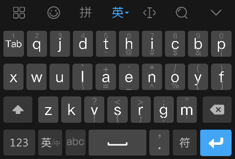

## Mobic3

又一个自定义的(非qwerty)手机输入法布局(魔比克), 改善了外观.



### 百度输入法

目前仅仅在百度输入法上看到了能够自定义布局的功能,因此该方案基于百度输入法

[此处](https://srf.baidu.com/default/)可以下载

#### 使用高级皮肤功能

设置->超级皮肤->我的(或本地)

#### 使用自定义皮肤

1. 下载合适的`*.bds`文件
2. 单击文件以使用
   1. 如果`bds`文件解压后的文件结构不正确,会导致该文件无法使用
   2. 如果有多个百度输入法或系统不知道用什么程序打开该文件,则选择百度输入法

### 使用此项目

```shell
cd /path/to/project
zip -qr myskin.bds ./*
```

如此会压缩成一个`mysqkin.bds`文件,可放到手机上继续使用

### 基于其他bds文件修改

```shell
unzip -q -d custom_skin custom_skin.bds
```

修改方法参照[百度手机输入法2.1皮肤文档](https://wenku.baidu.com/view/1505a58ccc22bcd126ff0cf7.html) 